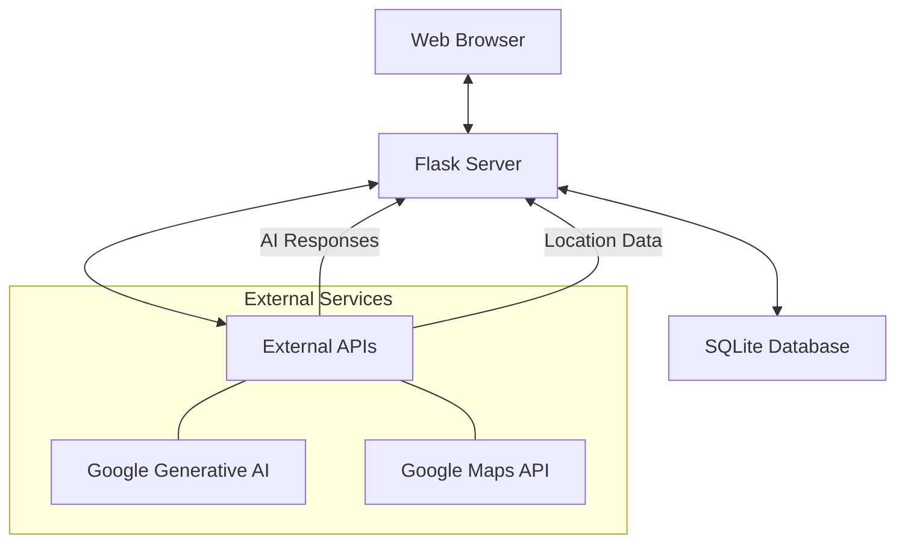
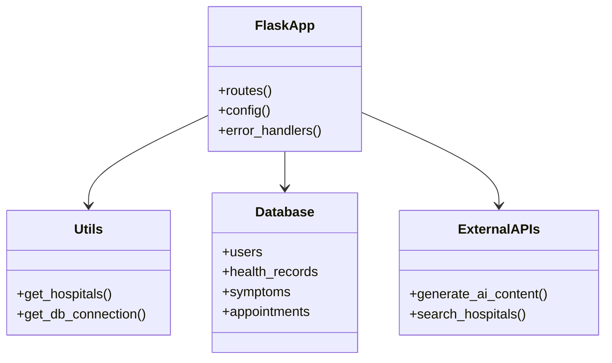
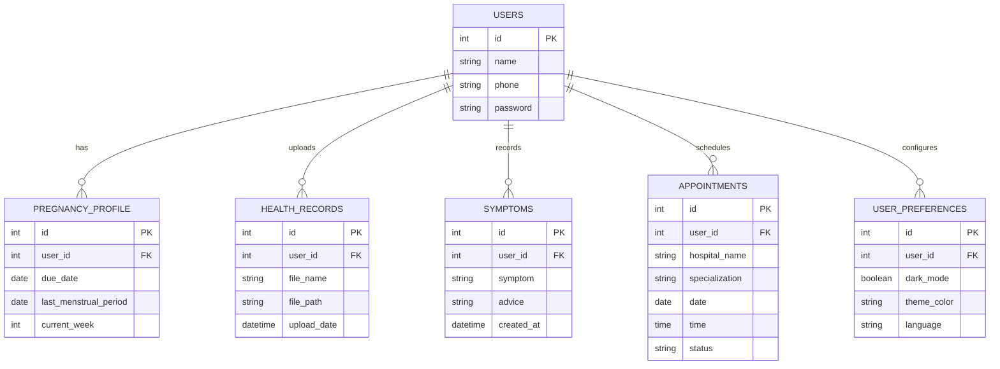
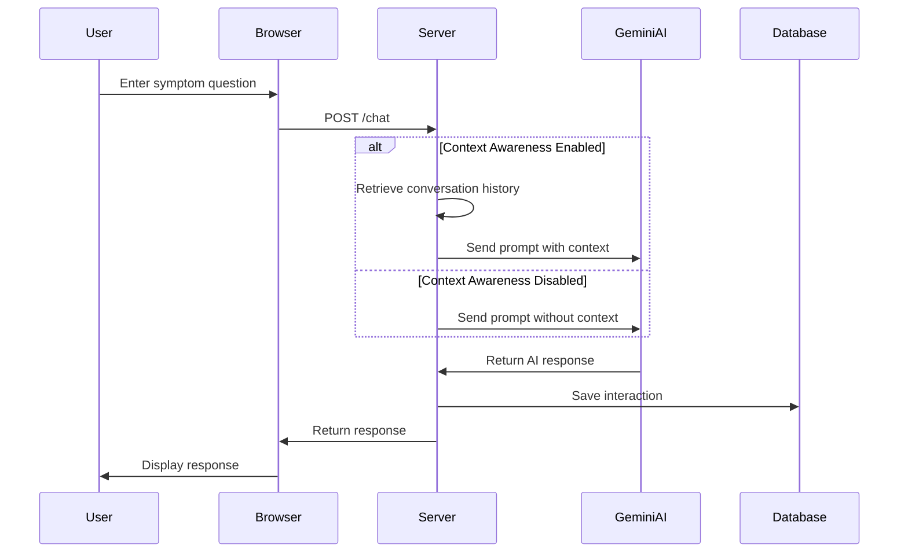
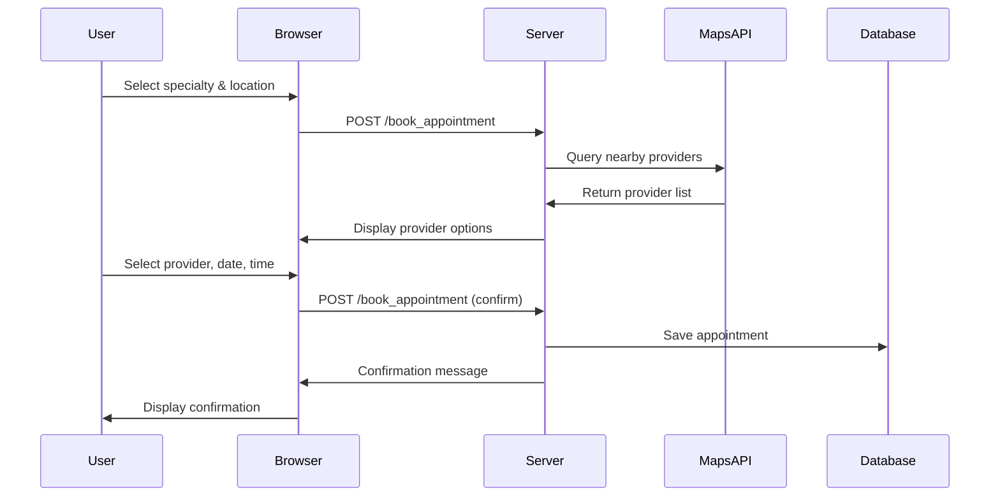
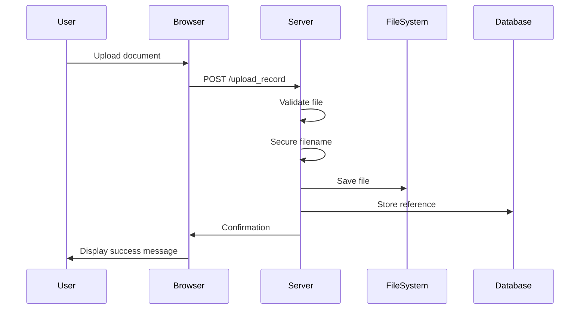
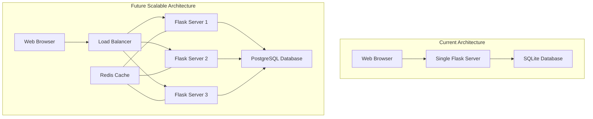

# Project Architecture

## System Overview

The Pregnancy Healthcare App is built on a Flask-based web application with a SQLite database. The system follows a traditional web application architecture with server-side rendering and some AJAX functionality for dynamic interactions.

## Core Components

### 1. Backend (Flask Application)

The backend is organized as follows:

- **app.py**: Main application file containing routes and business logic
- **hospital_utils.py**: Utility functions for hospital search functionality
- **models**: Data models representing the database schema
- **templates**: HTML templates using Jinja2 for rendering views
- **static**: CSS, JavaScript, and static assets

### 2. Database (SQLite)

The database schema includes the following key tables:

- **users**: User account information
- **pregnancy_profile**: Detailed pregnancy-related user information
- **health_records**: References to uploaded health documents
- **symptoms**: Record of symptom checker interactions
- **appointments**: Scheduled medical appointments
- **user_preferences**: User interface and system preferences

### 3. External Integrations

- **Google Generative AI (Gemini)**: Provides AI capabilities for the symptom checker
- **Google Maps API**: Hospital and healthcare provider location services

## Key Workflows

### 1. Symptom Checker Flow

### 2. Appointment Booking Flow

### 3. Health Records Management

## Security Considerations

1. **Authentication**: Session-based user authentication
2. **Data Protection**:
   - Secure file handling with sanitized filenames
   - Environment variables for sensitive configuration
3. **Input Validation**: Form validation for user inputs
4. **API Security**: API keys stored in environment variables

## Scalability Considerations

The current architecture uses SQLite which is suitable for development but has limitations for production scale:

- **Database Migration Path**: Design allows for future migration to PostgreSQL or MySQL
- **Stateless Design**: Session management can be adapted for distributed deployment
- **API-First Approach**: Core functionality exposed through internal APIs, enabling future mobile app development

